<!-- title: NTU CSIE Operating-System HW 02 -->
---
Student ID: R12631070  
Name: 林育新  
---

# 執行環境
環境建置與測試指令請見`rtos.sh`
- CPU 核心數量: 1  
- CPU 型號: 12th Gen Intel(R) Core(TM) i5-12400  
- RAM: 4GB

# 測試結果
## 預設 CFS 完全公平調度（SCHED_OTHER）
```bash
# 還原 7z 為預設 CFS
sudo chrt --other -p 0 $(pgrep 7z)

# 還原 mpv 為預設 CFS
sudo chrt --other -p 0 $(pgrep mpv)
```
- 7z
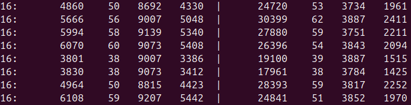

- mpv 偶爾掉偵 聲音偶爾撕裂
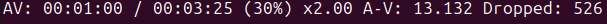


## 實時 FIFO 調度（SCHED_FIFO）GUI 卡到爆
```bash
# 設定 7z 為 FIFO（優先級 1）
sudo chrt --fifo -p 1 $(pgrep 7z)

# 設定 mpv 為 FIFO（優先級 2）
sudo chrt --fifo -p 2 $(pgrep mpv)
```

- 7z
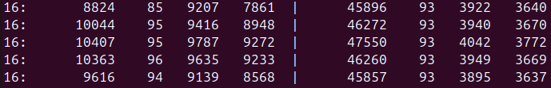

- mpv 幾乎卡死動不了


## 實時 Round-Robin 調度（SCHED_RR）GUI 卡到爆
```bash
# 設定 7z 為 RR（優先級 2）
sudo chrt --rr -p 2 $(pgrep 7z)

# 設定 mpv 為 RR（優先級 1）
sudo chrt --rr -p 1 $(pgrep mpv)
```

- 7z
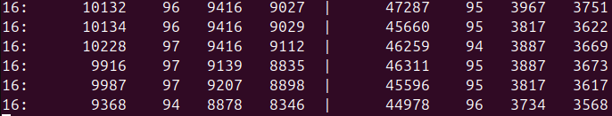

- mpv 同樣幾乎卡死
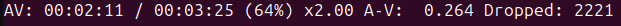


## Deadline 調度（SCHED_DEADLINE, EDF）
### Case 4.1: 標準參數 (小心所有EDF的run/period加起來要小於1)
```bash
# 設定 7z 為 Deadline（runtime=500μs, deadline=10ms, period=10ms）
sudo chrt --deadline --sched-runtime 500000 --sched-deadline 1000000 --sched-period 1500000 -p 0 $(pgrep 7z)

# 設定 mpv 為 Deadline（runtime=500μs, deadline=10ms, period=10ms）
sudo chrt --deadline --sched-runtime 500000 --sched-deadline 800000 --sched-period 1500000 -p 0 $(pgrep mpv)
```

- 7z
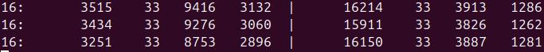

- mpv 
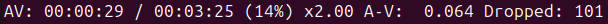


### Case 4.2: 增加 runtime（允許更多 CPU 時間）
```bash
sudo chrt --deadline --sched-runtime 800000 --sched-deadline 800000 --sched-period 1500000 -p 0 $(pgrep 7z)
```

- 7z
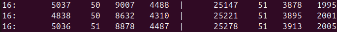

- mpv
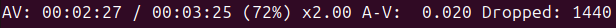


### Case 4.3: 縮短 deadline（更嚴格的截止時間）
```bash
sudo chrt --deadline --sched-runtime 500000 --sched-deadline 500000 --sched-period 1500000 -p 0 $(pgrep mpv)
```

- 7z
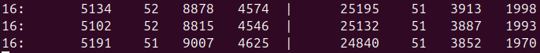

- mpv


### Case 4.4: 增加 period（降低調度頻率）
```bash
sudo chrt --deadline --sched-runtime 500000 --sched-deadline 800000 --sched-period 2000000 -p 0 $(pgrep mpv)
```

- 7z
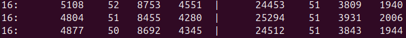

- mpv
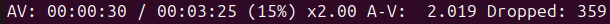


## dmesg
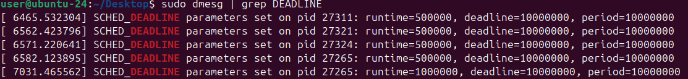

# 觀察與原因
- CFS 不是即時排程，解壓縮僅有大概一半的速度，導致輕微掉幀與聲音撕裂。
- FIFO 與 RR 雖然解壓縮速度看起來很高，但會讓整個系統變的超級卡，連使用 GUI 切換視窗都卡。因為這種排程方式是非搶占式，系統或IO的重要工作，無法搶占資源，導致使用者體感很差。
- EDF 的解壓縮速度幾乎完全受到runtime/period的比例影響，deadline怎麼設，體感好像感受不大。
  - 增加 run time: 因為分子提升，系統分配給解壓縮的時間變多，因此速度提升。
  - 縮短 deadline: 優先級提升，但可能是因為性能溢出，所以沒甚麼感覺。
  - 增加 period: 因為分母增加，導致系統分配給解壓縮的時間更少，解壓縮速度更慢。