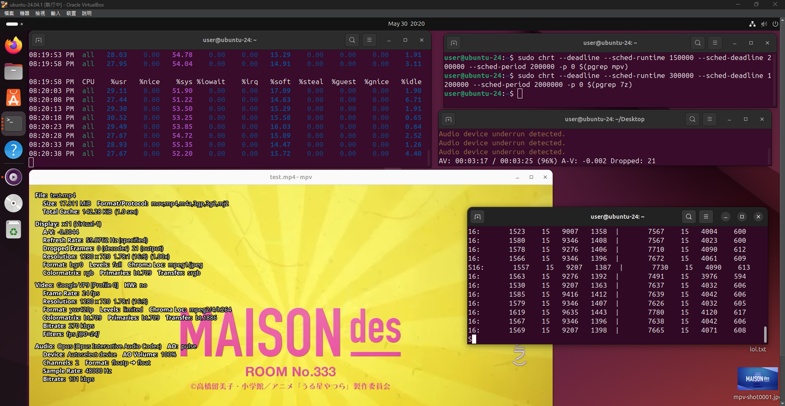
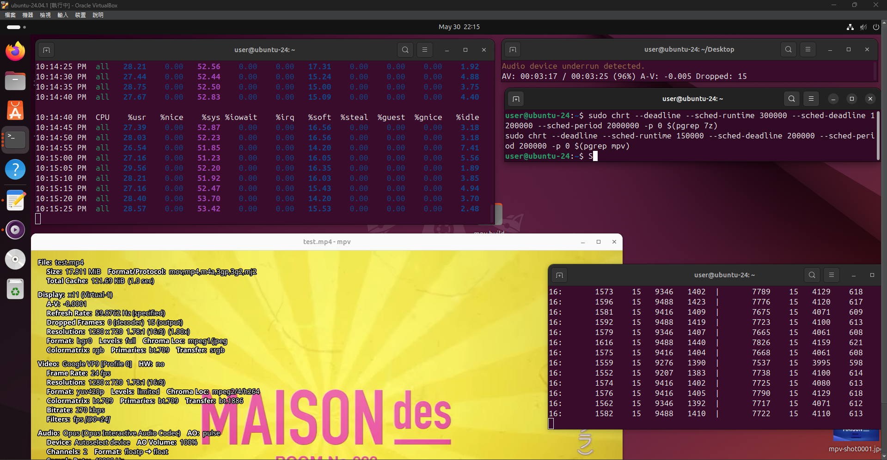
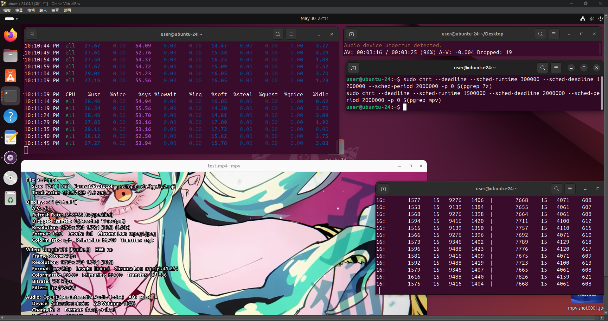
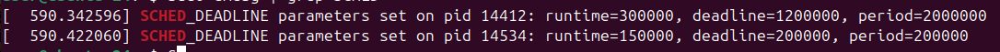
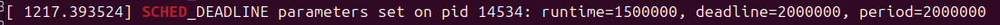

<!-- title: NTU CSIE Operating-System HW 02 -->
---
Student ID: R12631070  
Name: 林育新  
---

# 執行環境
內核修改與安裝過程請見`rtos.sh`
- CPU 核心數量: 1  
- CPU 型號: 12th Gen Intel(R) Core(TM) i5-12400  
- RAM: 4GB

## 執行指令
```bash
# 在終端1解壓縮
7z b 10000 -md16 # b benchmark模式(會自動產生虛擬檔案), 10 壓縮解壓次數, md16 字典大小為2^16=64KB

# 在終端2運行影片播放 強制 720p fps=24 (影片撥放中按I顯示詳細資訊)
mpv --loop=inf --geometry=1280x720 --vf=fps=24 test.mp4

# 在終端3觀察效能
mpstat 5 # 顯示 CPU 的各種統計資訊，每5秒更新一次

# 在終端4設定排程方法
# 指令見下個章節的每個排程
```

# 測試結果

## Shortest Job First (SJF)
### SJF 排程指令
```bash
sudo chrt --deadline --sched-runtime 300000 --sched-deadline 1200000 --sched-period 2000000 -p 0 $(pgrep 7z)
sudo chrt --deadline --sched-runtime 150000 --sched-deadline 200000 --sched-period 200000 -p 0 $(pgrep mpv)
```
### 參數想法
因為改成 SJF，相當於 deadline 實際上沒意義，就隨便設  
因為OS限制自己設定優先級的程式，CPU 使用率不能夠超過 95%  
因此一開始令 period=2000000，平均分配各 900000 給 mpv 和 7z  
因為要確保影片不掉偵，並且盡量維持高 CPU 使用率，不注重解壓縮的速度
發現 mpv 會卡之後，把 runtime 逐步從 7z 分配給 mpv  
但因為是 SJF，runtime提高以後，優先級反而降低，因此把 mpv 的參數全部 /10  
使得 mpv 整體使用率不變，但是優先級提升  

### SJF 效能量測


### dmesg


## Earliest Deadline First (EDF)
```bash
# 與SJF相同的參數 (此時MPV優先)
sudo chrt --deadline --sched-runtime 300000 --sched-deadline 1200000 --sched-period 2000000 -p 0 $(pgrep 7z)
sudo chrt --deadline --sched-runtime 150000 --sched-deadline 200000 --sched-period 200000 -p 0 $(pgrep mpv)

# 將MPV的參數*10 (此時7z優先)
sudo chrt --deadline --sched-runtime 300000 --sched-deadline 1200000 --sched-period 2000000 -p 0 $(pgrep 7z)
sudo chrt --deadline --sched-runtime 1500000 --sched-deadline 2000000 --sched-period 2000000 -p 0 $(pgrep mpv)
```

### 參數想法
- 已經在 SJF 確定兩個程式大概需要的 CPU 使用率  
  因此只要把 mpv 的 deadline 調整到比 7z 低，即可得到與 SJF 類似的效果  
  不過由於 EDF 的特性，本身就比較契合不掉偵的原理，因此掉偵的數量，相較SJF少了一點  
- 在第二組參數中，每個程式的 CPU 占用率不變，但是 MPV 整體的 deadline 增加  
  因此優先級稍微下降，所以可以觀察到掉偵數量稍微提升了一點


### EDF 效能量測
 與SJF相同的參數 (此時MPV優先)
 將MPV的參數*10 (此時7z優先)
### dmesg
 與SJF相同的參數 (此時MPV優先)
 將MPV的參數*10 (此時7z優先)
